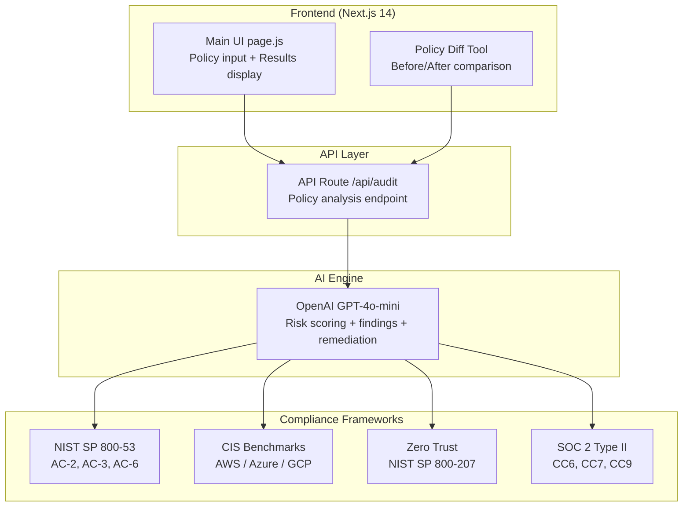

# SentryIQ — AI-Powered IAM Risk Auditor


**Live Demo → [sentryiq-five.vercel.app](https://sentryiq-five.vercel.app)**

SentryIQ is an open-source, AI-powered IAM security auditing tool that analyzes AWS IAM, Azure Entra, and GCP IAM policies and surfaces real security risks with severity ratings, exploit explanations, and actionable remediation steps — all mapped to your chosen compliance framework.

---

## 📋 Table of Contents

- [Overview](#-overview)
- [Architecture](#%EF%B8%8F-architecture)
- [Features](#features)
- [Tech Stack](#%EF%B8%8F-tech-stack)
- [Quick Start](#-quick-start)
- [Usage](#usage)
- [Compliance Modes](#compliance-modes)
- [Project Structure](#project-structure)
- [Related Projects](#-related-projects)
- [License](#license)
- [Author](#author)

---

## 📋 Overview

SentryIQ helps cloud security teams quickly identify and remediate risky IAM configurations across AWS, Azure, and GCP. It uses GPT-4o-mini to analyze policy JSON and produce risk scores (0-100), severity-rated findings, exploit examples, and step-by-step remediation — all filtered by your choice of compliance framework.

Key differentiators:

- **Multi-cloud** — AWS IAM, Azure Entra role definitions, and GCP IAM bindings
- **Compliance-aware** — Tailors findings to NIST SP 800-53, CIS Benchmarks, Zero Trust, or SOC 2
- **Policy Diff** — Compare before/after policies and see how your risk score changes
- **Free to use** — Open-source (MIT), self-host or use the live demo

---

## 🏗️ Architecture



---

## Features

- **Multi-Cloud Support** — Analyze AWS IAM, Azure Entra role definitions, and GCP IAM bindings
- **Compliance Mode Selector** — Tailor findings to NIST SP 800-53, CIS Benchmarks, Zero Trust Architecture, or SOC 2 Type II
- **AI Risk Scoring** — GPT-4o-mini assigns a 0-100 risk score with severity-rated findings (CRITICAL / HIGH / MEDIUM / LOW)
- **Expandable Findings** — Each finding includes a "Why this matters" explanation and a concrete exploit example
- **Policy Diff Tool** — Paste before/after versions of a policy and compare risk scores side-by-side
- **Remediation Steps** — Step-by-step fix instructions tailored to the cloud provider
- **Framework Badge Links** — Clickable compliance badges link directly to NIST, CIS, and other standard references
- **Sample Policies** — Pre-loaded samples across the full risk spectrum for quick demos
- **Loading Skeleton + Spinner** — Polished UX with animated skeletons during AI analysis
- **Copy to Clipboard** — Export findings and remediation with one click

---

## 🛠️ Tech Stack

| Layer | Technology |
|---|---|
| Framework | Next.js 14 (App Router) |
| Styling | Tailwind CSS |
| AI Engine | OpenAI GPT-4o-mini |
| Deployment | Vercel |
| Language | JavaScript (React) |
| Security Audit Targets | AWS IAM, Azure Entra, GCP IAM |

---

## ⚡ Quick Start

### Prerequisites

- Node.js 18+
- An OpenAI API key

### Local Setup

```bash
git clone https://github.com/TGKDre/sentryiq.git
cd sentryiq
npm install
```

Create a `.env.local` file:

```env
OPENAI_API_KEY=your_openai_api_key_here
```

Run the dev server:

```bash
npm run dev
```

Open [http://localhost:3000](http://localhost:3000).

---

## Usage

1. Select your **cloud provider** (AWS / Azure / GCP)
2. Choose a **compliance mode** (General, NIST, CIS, Zero Trust, SOC 2)
3. Paste a policy JSON or load a sample
4. Click **Run AI Audit** to get a full risk report
5. Use the **Policy Diff** tab to compare two versions of a policy

---

## Compliance Modes

| Mode | Frameworks Referenced |
|---|---|
| General Best Practices | Cloud provider best practices |
| NIST SP 800-53 | AC-2, AC-3, AC-6, IA-5, AU-2 |
| CIS Benchmarks | CIS AWS / Azure / GCP Foundations |
| Zero Trust Architecture | NIST SP 800-207 |
| SOC 2 Type II | CC6, CC7, CC9 |

---

## Project Structure

```
sentryiq/
├── app/
│   ├── page.js          # Main UI
│   ├── layout.js        # Root layout
│   ├── globals.css      # Tailwind base styles
│   └── api/
│       └── audit/
│           └── route.js # OpenAI audit API route
├── public/
├── .env.local           # API key (not committed)
└── README.md
```

---

## 🔗 Related Projects

- [IAM Portfolio](https://github.com/TGKDre/iam-portfolio) — IAM project portfolio collection
- [IAM Homelab](https://github.com/TGKDre/iam-homelab) — IAM infrastructure lab
- [IAM Zero Touch Automation](https://github.com/TGKDre/iam-zero-touch-automation) — Automated IAM workflows
- [Hybrid Identity Ops Lab](https://github.com/TGKDre/hybrid-identity-ops-lab) — Enterprise AD lab on OCI

---

## License

MIT — free to use, fork, and build on.

> Built for portfolio and educational purposes. Not a substitute for a professional security audit.

---

## Author

Built by [Andre Uzoukwu](https://github.com/TGKDre) — [LinkedIn](https://linkedin.com/in/andre-uzoukwu-tgkdre)
